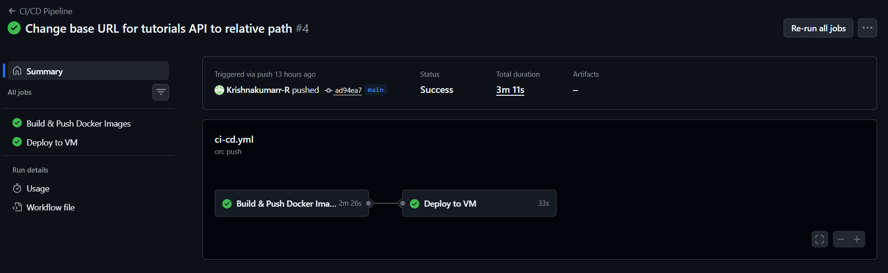
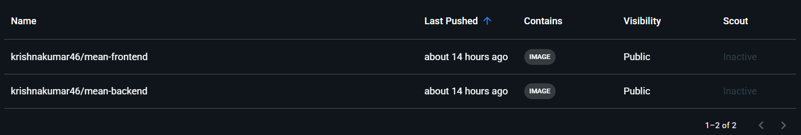
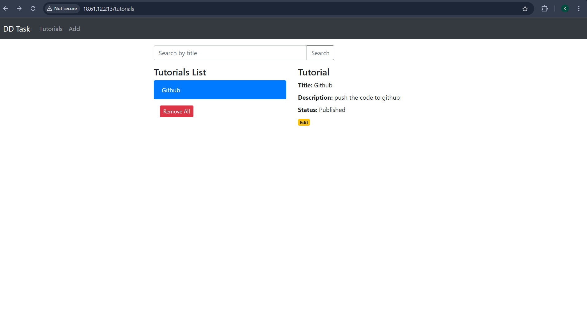
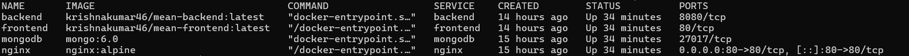

# MEAN Stack CRUD Application — Full DevOps Setup

> A fully containerized MEAN (MongoDB, Express, Angular, Node.js) application deployed on AWS EC2 with automated CI/CD via GitHub Actions and Nginx reverse proxy.

---

## 📁 Repository Structure

```
.
├── backend/                        # Node.js + Express REST API
│   ├── app/
│   │   ├── config/
│   │   │   └── db.config.js        # MongoDB connection (env-based)
│   │   ├── models/
│   │   │   ├── index.js
│   │   │   └── tutorial.model.js
│   │   ├── controllers/
│   │   │   └── tutorial.controller.js
│   │   └── routes/
│   │       └── tutorial.routes.js
│   ├── server.js                   # Express app entry point
│   ├── package.json
│   ├── Dockerfile                  # Backend container definition
│   └── .dockerignore
├── frontend/                       # Angular 15 SPA
│   ├── src/
│   │   └── app/
│   │       ├── components/         # Add, List, Details components
│   │       ├── models/
│   │       └── services/
│   │           └── tutorial.service.ts   # API calls via /api/ (relative)
│   ├── nginx.conf                  # Nginx config inside frontend container
│   ├── package.json
│   ├── Dockerfile                  # Multi-stage Angular build
│   └── .dockerignore
├── nginx/
│   └── nginx.conf                  # Main reverse proxy configuration
├── .github/
│   └── workflows/
│       └── ci-cd.yml               # GitHub Actions CI/CD pipeline
├── docker-compose.yml              # Orchestrates all 4 services
└── README.md
```

---

## 🏗️ Architecture Overview

```
                        ┌─────────────────────────────────┐
                        │         AWS EC2 (Ubuntu)        │
                        │                                 │
Internet ──► Port 80 ──►│  ┌──────────────────────────┐   │
                        │  │   Nginx Reverse Proxy    │   │
                        │  └────────┬────────┬────────┘   │
                        │           │        │            │
                        │    /api/* │        │ /*         │
                        │           ▼        ▼            │
                        │  ┌──────────┐  ┌──────────┐     │
                        │  │ Backend  │  │ Frontend │     │
                        │  │  :8080   │  │   :80    │     │
                        │  └────┬─────┘  └──────────┘     │
                        │       │                         │
                        │       ▼                         │
                        │  ┌──────────┐                   │
                        │  │ MongoDB  │                   │
                        │  │  :27017  │                   │
                        │  └──────────┘                   │
                        └─────────────────────────────────┘
```

All services run on an internal Docker bridge network (`mean-network`). Only port 80 is exposed to the internet via Nginx.

---

## 🐳 Docker Setup

### Backend Dockerfile

```dockerfile
FROM node:18-alpine
WORKDIR /app
COPY package*.json ./
RUN npm install --production
COPY . .
EXPOSE 8080
CMD ["node", "server.js"]
```

### Frontend Dockerfile (Multi-stage)

```dockerfile
# Stage 1: Build Angular app
FROM node:18-alpine AS builder
WORKDIR /app
COPY package*.json ./
RUN npm install
COPY . .
RUN npm run build -- --configuration production

# Stage 2: Serve with Nginx
FROM nginx:alpine
RUN rm -rf /usr/share/nginx/html/*
COPY --from=builder /app/dist/angular-15-crud /usr/share/nginx/html
COPY nginx.conf /etc/nginx/conf.d/default.conf
EXPOSE 80
CMD ["nginx", "-g", "daemon off;"]
```

### Docker Compose

```yaml
version: "3.8"
services:
  mongodb:
    image: mongo:6.0
    volumes:
      - mongodb_data:/data/db

  backend:
    image: krishnakumar46/mean-backend:latest
    environment:
      MONGODB_URL: mongodb://mongodb:27017/dd_db

  frontend:
    image: krishnakumar46/mean-frontend:latest

  nginx:
    image: nginx:alpine
    ports:
      - "80:80"
    volumes:
      - ./nginx/nginx.conf:/etc/nginx/conf.d/default.conf:ro
```

---

## 🔄 CI/CD Pipeline (GitHub Actions)

The pipeline triggers automatically on every push to `main`.

```
Push to main
     │
     ▼
┌─────────────────────────┐
│   Build & Push Job      │
│                         │
│  1. Checkout code       │
│  2. Login to Docker Hub │
│  3. Build backend image │
│  4. Push backend image  │
│  5. Build frontend image│
│  6. Push frontend image │
└────────────┬────────────┘
             │ on success
             ▼
┌─────────────────────────┐
│     Deploy Job          │
│                         │
│  1. SSH into EC2        │
│  2. git pull origin main│
│  3. docker compose pull │
│  4. docker compose up -d│
│  5. docker image prune  │
└─────────────────────────┘
```

### Required GitHub Secrets

| Secret            | Value                               |
| ----------------- | ----------------------------------- |
| `DOCKER_USERNAME` | `krishnakumar46`                    |
| `DOCKER_PASSWORD` | Docker Hub access token             |
| `VM_HOST`         | EC2 public/elastic IP               |
| `VM_USER`         | `ubuntu`                            |
| `VM_SSH_KEY`      | Contents of `.pem` private key file |

---

## 🌐 Nginx Reverse Proxy

The main Nginx config (`nginx/nginx.conf`) routes traffic:

```nginx
server {
    listen 80;

    # API requests → backend container
    location /api/ {
        proxy_pass http://backend:8080;
    }

    # Everything else → Angular frontend
    location / {
        proxy_pass http://frontend:80;
    }
}
```

The frontend container also has its own internal Nginx that handles Angular SPA routing with `try_files $uri $uri/ /index.html`.

---

## 🚀 Step-by-Step Setup & Deployment

### Prerequisites

- AWS account
- Docker Hub account (`krishnakumar46`)
- GitHub account
- Git installed locally
- Docker installed locally

---

### Step 1 — Clone and push to GitHub

```bash
git clone https://github.com/Krishnakumarr-R/mean-app-devops.git
cd mean-app
git remote set-url origin https://github.com/<your-username>/<your-repo>.git
git push origin main
```

---

### Step 2 — Launch AWS EC2

1. Go to **AWS Console → EC2 → Launch Instance**
2. Select **Ubuntu Server 24.04 LTS**
3. Instance type: `t2.micro` (free tier) or `t2.small`
4. Create a key pair → download `.pem` file
5. Security Group inbound rules:

| Type | Port | Source    |
| ---- | ---- | --------- |
| SSH  | 22   | 0.0.0.0/0 |
| HTTP | 80   | 0.0.0.0/0 |

6. Allocate an **Elastic IP** and associate it with the instance so the IP doesn't change on restarts

---

### Step 3 — Install Docker on EC2

```bash
# SSH into your VM
chmod 400 ~/Downloads/mean-app-key.pem
ssh -i ~/Downloads/mean-app-key.pem ubuntu@<your-elastic-ip>

# Install Docker
sudo apt update && sudo apt upgrade -y
curl -fsSL https://get.docker.com | sudo sh
sudo usermod -aG docker ubuntu
newgrp docker

# Verify
docker --version
docker compose version
```

---

### Step 4 — Clone repo on VM and first deploy

```bash
git clone https://github.com/Krishnakumarr-R/mean-app-devops.git ~/mean-app
cd ~/mean-app
docker compose up -d
docker compose ps
```

---

### Step 5 — Add GitHub Secrets

Go to GitHub repo → **Settings → Secrets and variables → Actions**:

```
DOCKER_USERNAME  = krishnakumar46
DOCKER_PASSWORD  = <docker hub access token>
VM_HOST          = <your elastic ip>
VM_USER          = ubuntu
VM_SSH_KEY       = <contents of .pem file>
```

---

### Step 6 — Trigger the pipeline

Push any change to `main`:

```bash
git add .
git commit -m "ci: trigger pipeline"
git push origin main
```

Watch it run at: `GitHub → Actions tab`

---

### Step 7 — Access the application

Open your browser:

```
http://<your-elastic-ip>
```

---

## 📸 Screenshots

### CI/CD Pipeline — GitHub Actions


_GitHub Actions pipeline showing both jobs: Build & Push → Deploy_

---

### Docker Images on Docker Hub


_Both `mean-backend` and `mean-frontend` images pushed to `krishnakumar46` Docker Hub account_

---

### Application UI — Tutorials List


_Angular frontend showing the tutorials list page_

---

### Docker Containers Running on EC2


_All 4 containers running: mongodb, backend, frontend, nginx_

---

## 🔧 Useful Commands

```bash
# Start all services
docker compose up -d

# Stop all services
docker compose down

# View logs
docker compose logs -f

# View logs for one service
docker compose logs -f backend

# Restart a single service
docker compose restart backend

# Pull latest images and redeploy
docker compose pull && docker compose up -d --remove-orphans

# Check running containers
docker compose ps
```

---

## 🌍 Environment Variables

| Variable      | Service | Default                           | Description               |
| ------------- | ------- | --------------------------------- | ------------------------- |
| `MONGODB_URL` | backend | `mongodb://localhost:27017/dd_db` | MongoDB connection string |
| `PORT`        | backend | `8080`                            | Backend listen port       |

---

## 🐞 Troubleshooting

| Problem                             | Fix                                                            |
| ----------------------------------- | -------------------------------------------------------------- |
| `ERR_CONNECTION_REFUSED` on `/api/` | Frontend image built with old localhost URL — rebuild and push |
| Pipeline SSH timeout                | Security Group must allow port 22 from `0.0.0.0/0`             |
| App not loading on port 80          | Check Security Group has HTTP port 80 open                     |
| IP changed after restart            | Set up AWS Elastic IP                                          |
| Containers not starting             | Run `docker compose logs` to check errors                      |

---

## 📦 Docker Hub Images

| Image    | Link                                  |
| -------- | ------------------------------------- |
| Backend  | `krishnakumar46/mean-backend:latest`  |
| Frontend | `krishnakumar46/mean-frontend:latest` |

---

## 👤 Author

**Krishna Kumar**

- Docker Hub: [krishnakumar46](https://hub.docker.com/u/krishnakumar46)
- GitHub: [krishnakumarr-R](https://github.com/Krishnakumarr-R)
